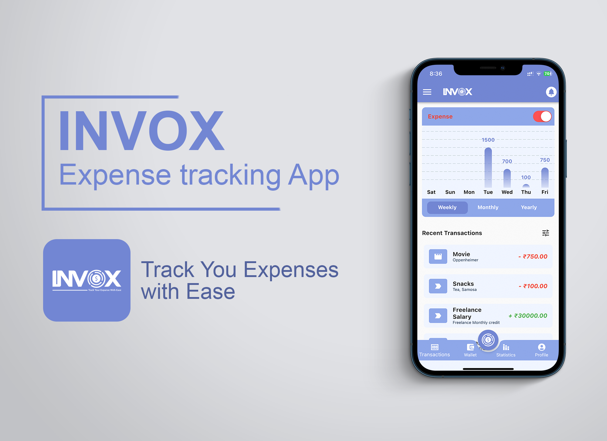
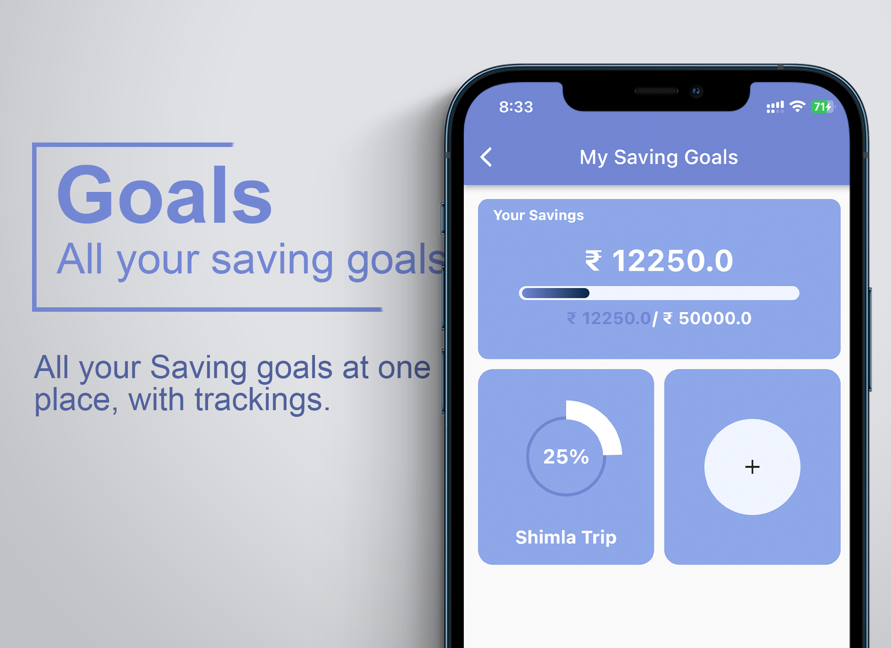

[](https://opensource.org/licenses/)
[](https://www.instagram.com/blufin.design/)

# INVOX - Expense Tracking App

App that allow you to track you expaenses as well as the savings with ease. This app is designed and developed to give your account and spendings in your pocket.




# Issues

If you face any issues please feel free to open and issue here.

# Contributing

If you want to contribute we suggest that you start with forking our repository and browse the code. Then you can look at our Issue-Tracker and start with fixing one ticket. We strictly use Test-Driven Development and Clean Code, so first read everything you can about these development methods.

Code developed in a different style will not be accepted. After you've created a pull request we will review your code and do a full testrun on your branch.

Make sure to stick to the format and architecture already being used, use of different architecture and code linting will not be accepted.

# Guide and setup

To start with the app, clone the repository and follow the steps given below.

### To clone the repo

```shell
git clone https://github.com/BluFin-Designs/Invox-App.git
```

### Next Steps

1. Open the terminal and navigate to the app folder

   ```shell
   cd invox
   ```

2. Run the below code from the root directory (i.e. `Invox-App/invox`).

   ```shell
   flutter pub get #to get all the dependency.
   ```

### Further Contributions

Once the App is up and running, use you logged in state to getinto the app.

> First install the release version in you device and then run from the IDE to maintain the logged in state.

## License

[GPL V3](https://choosealicense.com/licenses/gpl-3.0/)

## Authors

<table>
	<tr align="center">
		<td>
		Abhijeet Bhardwaj
		<p align="center">
			
		</p>
			<p align="center">
				<a href = "https://github.com/abhijeet-Bh">
					
				</a>
				<a href = "https://www.linkedin.com/in/abhijeet-bh/">
					
				</a>
			</p>
		</td>
        <td>
		Mahek Singhal
		<p align="center">
			
		</p>
			<p align="center">
				<a href = "https://github.com/maheksinghal">
					
				</a>
				<a href = "https://www.linkedin.com/in/mahek-singhal/">
					
				</a>
			</p>
		</td>
	</tr>
</table>
